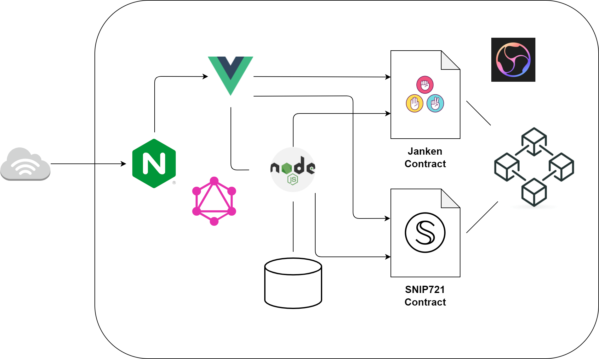

# Janken-API
Helper backend service to improve UX for Secret Janken Game. [janken-front](https://github.com/tak1827/janken-front) interacts with [janken-contract](https://github.com/tak1827/janken-contract) and stores its information to RDB through janken-api.

## System Architecture
<p align="center">
  
</p>

- janken-api reserves metadata of SNIP721
- janken-api synchronizes the status of offers retrieved from the contract
- janken-api watches the contract and rewrites the DB values in case of any changes in the owner of SNIP721

## Interact with CLI (Optional useful tools for development)
- deploy contract
```sh
node cmd/cmd.js deploy snip721
node cmd/cmd.js deploy janken
```

- mint SNIP721 token
```sh
node cmd/cmd.js tx mint_nft
```

- make offer
```sh
node cmd/cmd.js tx make_offer
```

- accept offer
```sh
node cmd/cmd.js tx accept_offer
```

- decline offer
```sh
node cmd/cmd.js tx decline_offer
```

- bet tokens
```sh
node cmd/cmd.js tx bet_token
```

### reference
- [janken-contract](https://github.com/tak1827/janken-contract) CosmWasm Janken contract for Secrete Netork.
- [janken-front](https://github.com/tak1827/janken-front) Frontend implementation for Secret Janken Game.
